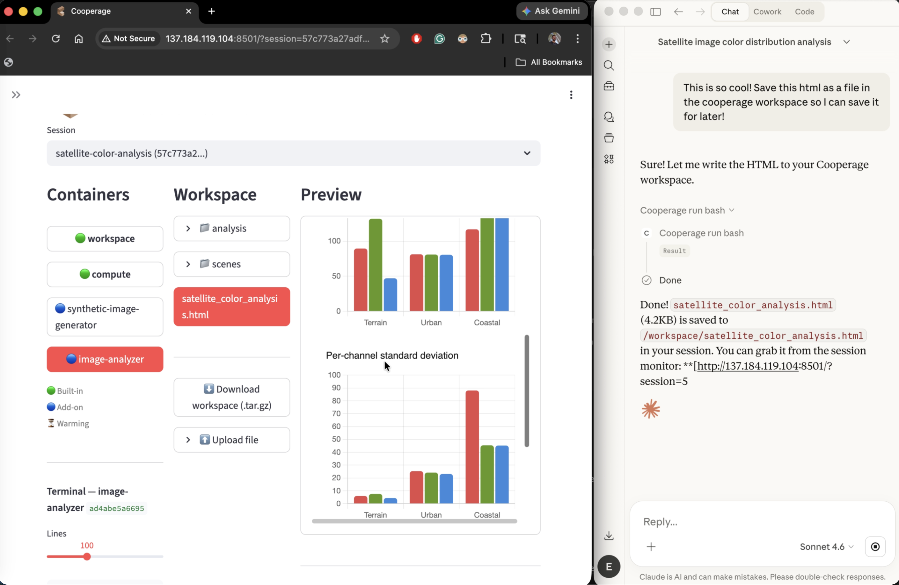

<p align="center">
  
</p>

---

Give your AI tools their own compute. Cooperage runs each tool in an isolated container with dedicated resources and a shared workspace — on your infrastructure, under your control.

<p align="center">
  
</p>

## The problem

You've got tools. Maybe a simulation engine, an analysis library, a data pipeline. You can call them one at a time, but what happens when your LLM needs to chain them together, pass data between them, and run them on real infrastructure?

Cooperage is that infrastructure layer. Register your tools, and your LLM orchestrates them across isolated containers that share a workspace volume. Data flows through files, not context windows.

## How it works

```
LLM (Claude, GPT, etc.)
       │
       ▼
┌─────────────────────────┐
│    Cooperage Gateway    │  ← one endpoint your LLM talks to
└────────────┬────────────┘
             │
     ┌───────┴───────┐
     ▼               ▼
[Container A]   [Container B]     isolated containers,
 your tool        your tool        spun up on demand
     └───────┬───────┘
      shared /workspace volume    data persists across calls
```

**The key idea:** multiple containers per session, one shared `/workspace` volume. A generator writes a file, an analyzer reads it, a report writer summarizes it — all orchestrated by the LLM, all passing data through the same volume.

## Quick start

**Prerequisites:** Python 3.11+, [uv](https://docs.astral.sh/uv/getting-started/installation/), Docker running.

```bash
git clone https://github.com/cooperage-io/cooperage.git && cd cooperage
uv sync
```

### Register a tool

**Option A — Docker image** (full control):

```bash
docker buildx build --load -t my-analyzer:latest my-server/
uv run cooperage register \
  --name my-analyzer \
  --image my-analyzer:latest \
  --description "Analyze data in /workspace"
```

**Option B — Wrap an existing API** (no Docker needed):

```yaml
# weather-api.yaml
name: weather
type: rest-api
base_url: https://api.weather.com/v1
auth:
  type: bearer
  token: ${WEATHER_API_KEY}
tools:
  - name: get_forecast
    description: Get weather forecast
    method: GET
    path: /forecast
    params:
      latitude: {type: number, description: "Latitude"}
      longitude: {type: number, description: "Longitude"}
```

```bash
uv run cooperage register --from weather-api.yaml --env WEATHER_API_KEY=sk-xxx
```

**Option C — Wrap LangChain tools**:

```yaml
# my-tools.yaml
name: my-tools
type: langchain
source: /workspace/tools.py
```

```bash
uv run cooperage register --from my-tools.yaml
```

### Connect to Claude Desktop

Add to `~/Library/Application Support/Claude/claude_desktop_config.json`:

```json
{
  "mcpServers": {
    "cooperage": {
      "command": "/Users/YOU/.local/bin/uv",
      "args": ["--directory", "/path/to/cooperage", "run", "--no-active", "cooperage", "start"]
    }
  }
}
```

Restart Claude Desktop. The hammer icon appears — Cooperage is connected.

### HTTP mode

```bash
uv run cooperage start --sse
```

Starts the gateway on `http://localhost:8080/mcp`.

### Remote gateway (cloud deployment)

```bash
uv run cooperage start --proxy http://your-server:8080/mcp --api-key sk-your-key
```

Bridges your local Claude Desktop to a remote gateway over HTTP.

## What the LLM can do

| Tool | Purpose |
|------|---------|
| `cooperage_list_servers` | Discover available tools |
| `cooperage_create_session` | Start a workspace session |
| `cooperage_call_tool` | Call a tool on any server |
| `cooperage_list_tools` | See what a server offers |
| `cooperage_workspace_read/write/list` | Read and write files in the shared workspace |
| `cooperage_run_script` | Execute Python with numpy/pandas/scipy |
| `cooperage_run_bash` | Execute shell commands |
| `cooperage_get_container_logs` | View a container's stdout/stderr |
| `cooperage_set_session_expiry` | Extend a session (up to 72 hours) |
| `cooperage_end_session` | Tear down and clean up |

## Multi-tool pipelines

This is the core use case. Containers share `/workspace`:

```
1. cooperage_call_tool(session, "web-scraper", "scrape_table",
     {url: "https://example.com/data", output: "sales.csv"})
     → fetches HTML table, saves /workspace/sales.csv

2. cooperage_call_tool(session, "csv-analyzer", "analyze_csv", {path: "sales.csv"})
     → reads sales.csv, returns statistics

3. cooperage_call_tool(session, "csv-analyzer", "plot_column",
     {path: "sales.csv", column: "revenue", chart_type: "bar", output: "chart.png"})
     → generates /workspace/chart.png

4. cooperage_call_tool(session, "pdf-report", "generate_report", {
     title: "Sales Analysis",
     sections: [
       {heading: "Data", file: "sales.csv"},
       {heading: "Revenue by Region", file: "chart.png"},
     ],
     output: "report.pdf"
   })
     → compiles /workspace/report.pdf
```

Three containers. One session. One shared volume. Data flows through files, not context windows.

## Writing your own server

Any Docker image that serves tools on port 8000 works. Minimal example:

```python
from mcp.server.fastmcp import FastMCP
import uvicorn

mcp = FastMCP("my-server", json_response=True, stateless_http=True)

@mcp.tool()
def my_tool(input_path: str) -> str:
    """Process a file from /workspace."""
    data = open(f"/workspace/{input_path}").read()
    # ... do work ...
    open("/workspace/result.json", "w").write(result)
    return "Done. Result at /workspace/result.json"

if __name__ == "__main__":
    uvicorn.run(mcp.streamable_http_app(), host="0.0.0.0", port=8000)
```

Example servers:

| Server | Industry | Tools |
|--------|----------|-------|
| [csv-analyzer](example-servers/csv-analyzer/) | General | Statistics, charts, CSV comparison |
| [web-scraper](example-servers/web-scraper/) | General | URL text extraction, HTML table → CSV |
| [pdf-report](example-servers/pdf-report/) | General | Compile workspace files into PDF reports |
| [sequence-analyzer](example-servers/sequence-analyzer/) | Biotech | FASTA parsing, GC content, motif search, composition charts |
| [finance-toolkit](example-servers/finance-toolkit/) | Finance | Portfolio analysis, risk metrics, correlation matrix |
| [log-analyzer](example-servers/log-analyzer/) | DevOps | Log parsing, error grouping, anomaly detection, incident timeline |
| [image-analyzer](example-servers/image-analyzer/) | Imaging | Image analysis with numpy/PIL |
| [synthetic-image-generator](example-servers/synthetic-image-generator/) | Imaging | Generate test imagery |

## Wrapping existing tools

Don't want to write a Docker image? Use `cooperage register --from` with a YAML config:

| Type | What you provide | What happens |
|------|-----------------|--------------|
| `rest-api` | Base URL, auth, tool definitions | HTTP calls proxied to your API (no container) |
| `langchain` | Python file or pip package with `@tool` functions | Auto-discovered and wrapped |

For plain Python functions, use the SDK's `serve_functions()` — three lines, no YAML needed. See [cooperage-sdk](https://github.com/cooperage-io/cooperage-sdk).

Auth credentials use `${ENV_VAR}` syntax — secrets are passed via `--env`, never stored in config files.

## Kubernetes

Drop-in backend. Same tools, same config — containers run as Pods.

```bash
COOPERAGE_ORCHESTRATOR=kubernetes uv run cooperage init-k8s
COOPERAGE_ORCHESTRATOR=kubernetes uv run cooperage start
```

## Web UI

Real-time dashboard for monitoring sessions, viewing container logs, and browsing workspace files.

```bash
uv run cooperage ui
```

Supports file preview (images, HTML, CSV, PDF), file upload, and session expiry controls.

## Enterprise

[cooperage-enterprise](https://github.com/cooperage-io/cooperage-enterprise) adds:

- **Authentication** — API keys, JWT (HS256), OIDC/SSO (Azure AD, Okta, Auth0)
- **Multi-tenancy** — per-tenant session isolation and RBAC
- **Session quotas** — `max_sessions` per tenant
- **Audit logging** — JSON-lines event log for every tool call

The open-source core includes:
- Per-container CPU and memory limits
- Per-session network isolation
- Private image registry auth
- Container idle timeout and session TTL management

## Configuration

All settings use the `COOPERAGE_` prefix. Can go in `.env`.

| Variable | Default | Description |
|----------|---------|-------------|
| `COOPERAGE_ORCHESTRATOR` | `docker` | `docker` or `kubernetes` |
| `COOPERAGE_SESSION_TTL_SECONDS` | `1800` | Session auto-expiry (30 min) |
| `COOPERAGE_CONTAINER_IDLE_TIMEOUT` | `600` | Stop idle containers (10 min) |
| `COOPERAGE_CONTAINER_STARTUP_TIMEOUT` | `120` | Readiness probe timeout |
| `COOPERAGE_DEFAULT_CPU_LIMIT` | `1.0` | CPU limit per container |
| `COOPERAGE_DEFAULT_MEMORY_LIMIT` | `512m` | Memory limit per container |
| `COOPERAGE_NETWORK_ISOLATION` | `true` | Per-session Docker networks |
| `COOPERAGE_UI_URL` | — | UI URL shown after session creation |

## CLI

```
cooperage register       Register a tool (Docker image or --from config)
cooperage deregister     Remove a tool
cooperage list-servers   List registered tools
cooperage sessions       List active sessions
cooperage start          Start the gateway (stdio, --sse, or --proxy)
cooperage init-k8s       Bootstrap Kubernetes namespace
cooperage ui             Launch the web dashboard
cooperage clear          Stop all containers and reset state
```

## Tests

```bash
uv run pytest -v
```

## License

[MIT](LICENSE)
